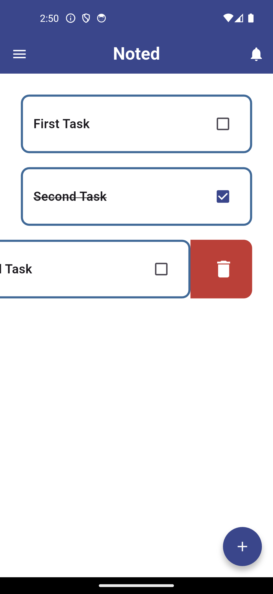
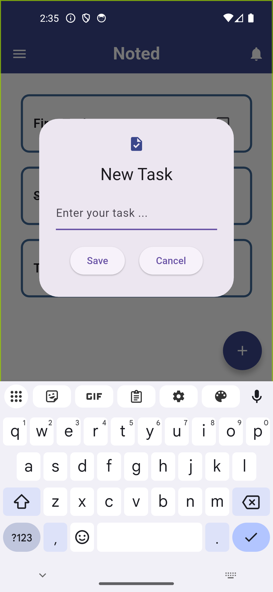

# 📌 Noted

Aplikasi Flutter yang memungkinkan pengguna mengelola daftar tugas dengan fitur **tambah, hapus, dan tandai tugas selesai**.

## 📸 Screenshot

### 📷 Screenshot Aplikasi  

  
  

## 🚀 Fitur
- ✅ Tambah tugas baru  
- 🗑️ Hapus tugas dengan efek geser (Dismissible)  
- 💾 Simpan tugas menggunakan Hive  
- 🎨 Animasi efek geser dengan warna merah  
- 🔊 (Opsional) Tambahkan suara saat menghapus tugas  

## 🛠️ Teknologi yang Digunakan
- **Flutter** (Dart)
- **Hive** (Local Database)
- **Provider** (State Management)
- **Path Provider** (Penyimpanan Data)

### 📌 Cara Penggunaan

- Klik **Floating Action Button (+)** untuk menambah tugas baru.  
- Ketik nama tugas, lalu tekan **Save**.  
- Geser tugas ke kiri untuk **menghapusnya**.  
- Klik tugas untuk menandainya sebagai **selesai**.  

### 📝 Todo List

- ✅ Menambahkan fitur **Hive** untuk menyimpan tugas.  
- ✅ Implementasi fitur **geser untuk menghapus tugas**.
